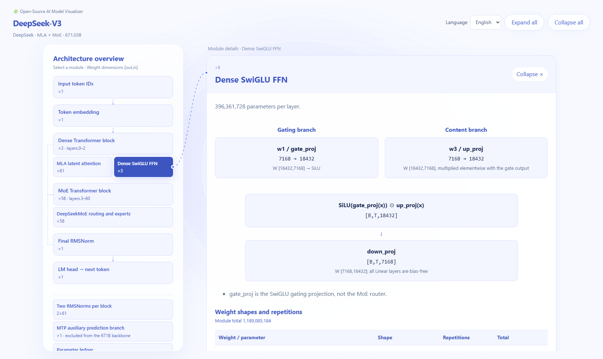

# 🧩 Open-Source AI Model Visualizer

Detailed, interactive architecture breakdowns of open-weight models, covering computational paths, tensor shapes, parameter counts, and component boundaries. English is the default language; a Chinese version is available on every page.

[Explore the visualizer](https://open-model-atlas.molanlin0818.chatgpt.site)

Use **Language** in the top-right corner to switch between **English** and **中文** on any page.

| Model | Architecture |
| --- | --- |
| DeepSeek-V3 | Multi-head Latent Attention and Mixture of Experts |
| Llama 3.1 8B Instruct | Dense Transformer with Grouped-Query Attention |
| Qwen3-Next-80B-A3B Instruct | Gated DeltaNet, gated attention, and Mixture of Experts |
| Mamba-2 2.7B | State-space model with State Space Duality |
| Qwen3-VL-8B Instruct | Vision-language Transformer with DeepStack |
| Whisper large-v3 | Audio encoder and text decoder with cross-attention |
| FLUX.1-schnell | Double-stream and single-stream diffusion Transformer |
| Nemotron-H 8B Base 8K | Hybrid Mamba, attention, and MLP backbone |

Open `dist/index.html` in a browser, or rebuild the static pages with `node build.cjs`. No runtime dependencies are required. Model pages cite official sources and document parameter-count scopes and verification limits. Model weights are not included; upstream model licenses apply independently.
